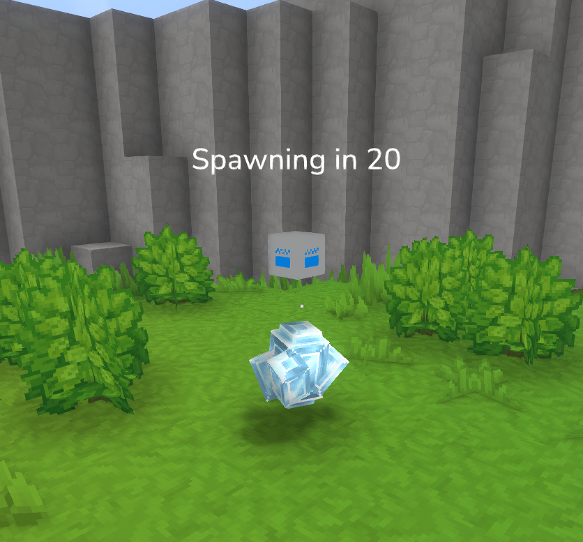

## Hytale Bedwars Plugin
Recreation of the classic Hypixel minigame Bedwars for Hytale.  
Active diamond generator during setup (which make it visible)

> [!CAUTION]
>❗ Currently work in progress. 

### Current features
- Map creation, editing and validation
- Generators
- Basic shops
- Groundwork for teams and parties
- No game loop yet

### Planned features
- Default configs with values similar to Minecraft/Hypixel
- Familiar fireball and tnt physics (fireball jumping)
- Rotating items
- Team chat
- Team chests (with punch deposit)
- Advanced hotbar loadout
- Nice HUD for players with info
- Helper tools for setting up maps, shops
- Statistics
- EVERYTHING completely data driven and configurable using assets - maps, resources, shops, messages

### Installation
The plugin can be downloaded from the Releases page. It must be put in the mods folder along with kotlin.jar file from [Kotale](https://github.com/helightdev/kotale/releases) which provides neccesary Kotlin libraries. 